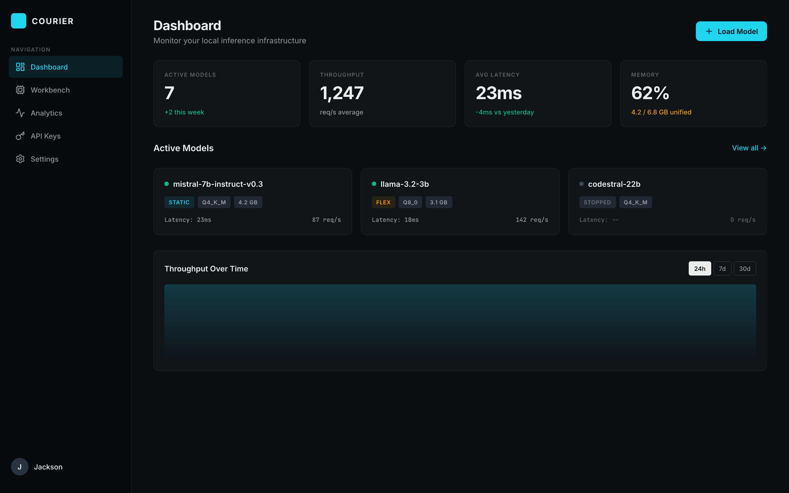

<p align="center">
  
</p>

<h1 align="center">Courier Design System</h1>

<p align="center">
  <strong>Engineering constitution, Claude Code skills, and 10-step design system build sequence — custom-built for Courier.</strong>
</p>

<p align="center">
  
  
  
  
</p>

---

## Quick Start

```bash
# 1. Clone this repo
git clone https://github.com/galaxy-co-ai/courier-design-system.git

# 2. Give BOOTSTRAP.md to your Claude Code — it wires everything in automatically

# 3. Read the product brief first, then run prompts 00-09
```

> **One-step setup:** Give `BOOTSTRAP.md` to Claude Code. It reads the repo, copies the right files into your Courier project, and tells you how to start. Nothing manual.

---

## What's Inside

### `constitution/` — Engineering Constitution

Quality standards, decision framework, and anti-patterns — adapted from a system running across 10+ production projects. Defines what Courier UI should feel like, what it should never do, and how to make consistent decisions under pressure.

| File | Purpose |
|------|---------|
| [`ENGINEERING-CONSTITUTION.md`](constitution/ENGINEERING-CONSTITUTION.md) | Design philosophy, code standards, quality gates, decision framework |
| [`QUICK-REFERENCE.md`](constitution/QUICK-REFERENCE.md) | One-screen cheat sheet |

### `skills/` — Claude Code Skills Package

A skill that triggers automatically on any UI work and teaches Claude Code Courier's design language — cyan/amber accents, border-based depth, GeneralSans + HubotSans typography, interaction patterns. Once installed, Claude Code builds like it knows the product.

| File | Purpose |
|------|---------|
| [`SKILL.md`](skills/ui-engineering/SKILL.md) | Skill triggers, design language, component rules, quality bar |
| [`references/design-tokens.md`](skills/ui-engineering/references/design-tokens.md) | Token architecture — colors, spacing, typography, motion |
| [`references/component-patterns.md`](skills/ui-engineering/references/component-patterns.md) | 15 component patterns with ASCII diagrams and TypeScript interfaces |
| [`references/quality-checklist.md`](skills/ui-engineering/references/quality-checklist.md) | Pre-commit quality audit — visual, interaction, accessibility, code |

### `design-system/prompts/` — 10-Step Build Sequence

Run these in order. Each prompt is self-contained — tells Claude Code exactly what to read, build, and verify. By the end, you have a complete design system.

| Step | Prompt | Output |
|:----:|--------|--------|
| 0 | [`00-brand-audit`](design-system/prompts/00-brand-audit.prompt.md) | Extracts every visual value currently in the codebase |
| 1 | [`01-color-system`](design-system/prompts/01-color-system.prompt.md) | OKLCH color tokens, 12-step gray scale, accent system |
| 2 | [`02-typography`](design-system/prompts/02-typography.prompt.md) | Type scale, font stacks, numeric display features |
| 3 | [`03-spacing-layout`](design-system/prompts/03-spacing-layout.prompt.md) | Spacing tokens, layout system, App Shell component |
| 4 | [`04-components-core`](design-system/prompts/04-components-core.prompt.md) | 10 foundational atoms — Button, Badge, Input, Card, etc. |
| 5 | [`05-components-data`](design-system/prompts/05-components-data.prompt.md) | 7 data components — MetricCard, ModelCard, DataTable, Charts |
| 6 | [`06-components-nav`](design-system/prompts/06-components-nav.prompt.md) | 5 navigation components — Sidebar, TabBar, PageHeader |
| 7 | [`07-motion-interaction`](design-system/prompts/07-motion-interaction.prompt.md) | Motion tokens, hover guards, focus rings, loading patterns |
| 8 | [`08-patterns-pages`](design-system/prompts/08-patterns-pages.prompt.md) | 4 reference pages — Dashboard, Workbench, Analytics, Settings |
| 9 | [`09-documentation`](design-system/prompts/09-documentation.prompt.md) | Living docs, token reference, contribution guide |

### `product-brief/` — Product Design Brief

**Read this first.** Based on a real interview with a power user running Courier in production across multiple projects. Covers what works, what's missing, and where the product should go — including the shift from model-centric to project-centric thinking, and the agent-first vision.

| File | Purpose |
|------|---------|
| [`COURIER-PRODUCT-BRIEF.md`](product-brief/COURIER-PRODUCT-BRIEF.md) | User research, competitive landscape, proposed IA, design patterns |

### `docs/specs/` — Design Specifications

Detailed specs for features that go beyond the base design system. These are deep enough for Claude Code to build from without wireframes.

| File | What It Covers |
|------|---------------|
| [`Training Page`](docs/specs/2026-03-22-training-page-design.md) | Three training modes (Teach/Recipe/Onboard), territory world map, campaign roadmaps, guardrail system, workbench progression, gamification scoping |

### `research/` — Source Material

Reference only — the process behind the deliverables.

| File | Purpose |
|------|---------|
| [`courier-profile.md`](research/courier-profile.md) | Product profile — stack, identity, positioning, competitive context |
| [`courier-mcp-data.md`](research/courier-mcp-data.md) | MCP server capabilities and data schema |
| [`constitution-audit.md`](research/constitution-audit.md) | Transferable patterns from a battle-tested engineering constitution |
| [`design-system-audit.md`](research/design-system-audit.md) | Cross-project design system audit mapped to Courier's needs |

---

## The Promise

By the time you run all 10 prompts, you'll have:

- **Color system** — OKLCH, 12-step cool-slate gray scale, cyan + amber identity preserved
- **Typography** — GeneralSans + HubotSans compound type scale, tabular-nums for data
- **Spacing & layout** — 4px grid, semantic tokens, responsive App Shell
- **25+ components** — core atoms, data-display, navigation chrome
- **Motion system** — duration tokens, hover guards, focus rings, reduced-motion support
- **4 reference pages** — Dashboard, Workbench, Analytics, Settings
- **Full documentation** — token reference, component docs, contribution guide

---

## Design Principles

| Principle | What It Means |
|-----------|---------------|
| **Dark-first** | Slate backgrounds, surface luminance for depth, minimal shadows |
| **Border-based hierarchy** | 1px borders + background stepping, not drop shadows |
| **Data-dense** | Show more, scroll less — operators need everything visible |
| **Two accents** | Cyan for actions/positive, amber for status/warnings — never crossed |
| **Technical honesty** | Users know what Q4_K_M means. Don't dumb it down. |
| **Every pixel earns its space** | No decorative elements, no marketing copy in product chrome |

---

## Credits

Built by **Dalton Cox** — Co-founder & Tech Lead at [GalaxyCo.ai](https://galaxyco.ai)

Courier is Jackson's product. These are tools to help him build it faster and sharper.

---

<p align="center"><em>Ship fast. Ship sharp. Ship local.</em></p>
